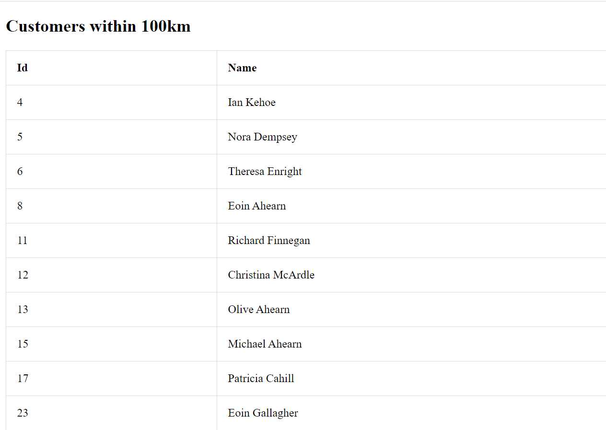
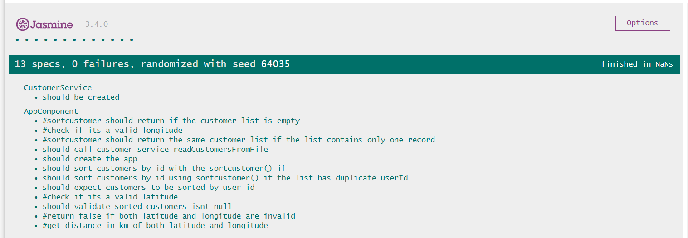

# Intercom Interview Assessment
This project was generated with [Angular CLI](https://github.com/angular/angular-cli) version 8.3.2.

## Second Interview Question
What's your proudest achievement? It can be a personal project or something you've worked on
professionally. Just a short paragraph is fine, but I'd love to know why you're proud of it, what
impact it had (If any) and any insights you took from it.

My proudest achievement in recent memory is the deployment of Quickservices, a web application I developed in response to the inability of customers to transact due to COVID-19 restrictions. The app allows customers carry out transactions they would ordinarily need to perform in the banking hall from the comfort of their homes. I was particularly proud of the fact the project was deployed bug free within a month of initiation, as it eliminated the risk versus reward dilemma of coming into the banking hall for customers. There was also a significant impact for the bank as $3 million in revenue was accrued through the channel within 3 months of deployment. I gained particular insight into distributed systems on the project while also becaming the go to person for test driven development to ensure bug free deployment in my team

## Getting Started
Download and install Node js using this website `https://nodejs.org/en/download/`

Install the angular cli using this command on your terminal `npm i @angular/cli`

The entry point of the project is located in `https://github.com/Amenawon/Product-engineer-assessment/blob/main/src/app/app.component.ts`

The view/ui is located in `https://github.com/Amenawon/Product-engineer-assessment/blob/main/src/app/app.component.html`

Run `ng serve` to run server/start the project. Navigate to `http://localhost:4200/`. 

This is the output shown below.

 

## Running unit tests

Run `ng test` to execute the unit tests via [Karma]

The output of the tests is shown below

The specs are highlighted with the .spec.ts in the code . i.e `app.component.spec.ts`

 

## Author 
Amenawon Esezobor
